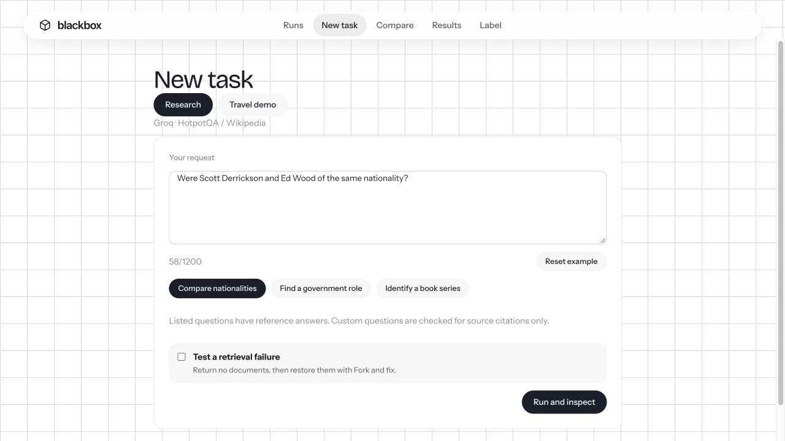
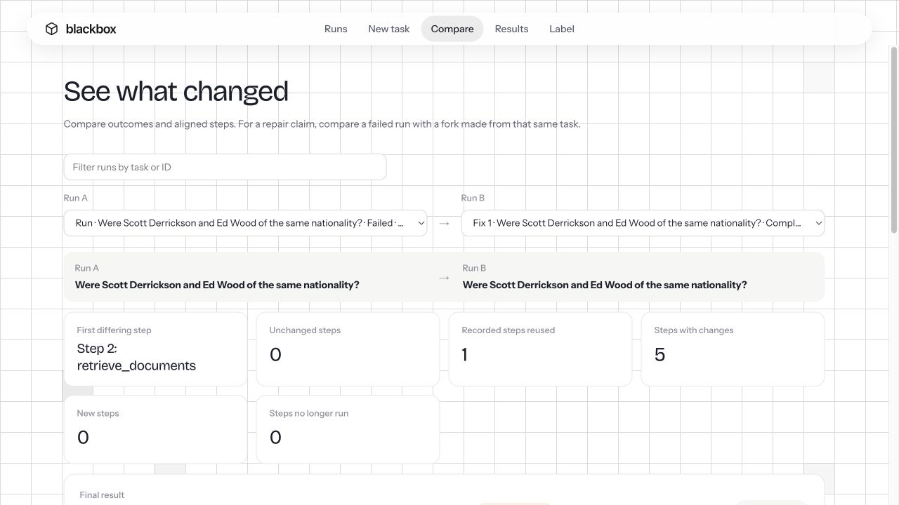
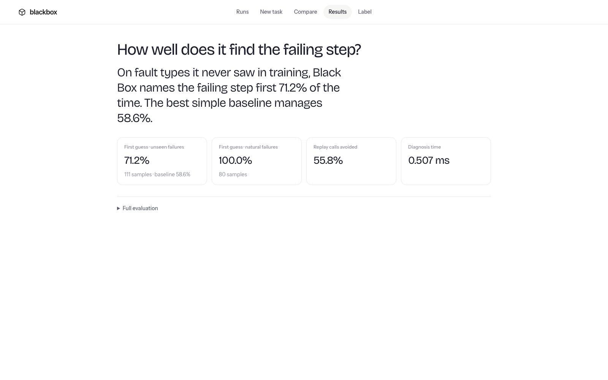
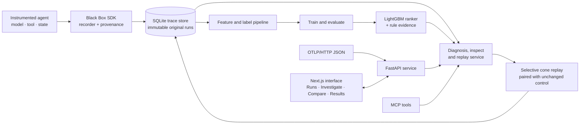

<div align="center">

# Black Box

### A flight recorder and failure debugger for AI agents

Record a run. Find the suspicious step. Test a targeted fix against a control.


</div>

---

## The problem

An agent can complete many steps correctly and still fail because of one bad decision along the way. A normal trace records the calls; Black Box connects them, ranks likely failure points, and lets you test a change without replaying unaffected work.

## Screenshots

Research uses real HotpotQA passages and hosted Groq calls. The Results screenshot shows the separate synthetic travel benchmark.

<table>
  <tr>
    <td align="center"><strong>New task</strong></td>
    <td align="center"><strong>Compare a repair</strong></td>
    <td align="center"><strong>Evaluation results</strong></td>
  </tr>
  <tr>
    <td></td>
    <td></td>
    <td></td>
  </tr>
</table>

## How it works

1. **Record:** the SDK captures instrumented model, tool and state steps, along with their inputs, outputs and data dependencies.
2. **Diagnose:** a trained ranker and rule evidence highlight candidate failure steps. The diagnosis can abstain when the evidence is not strong enough.
3. **Inspect:** follow a value through the run graph and review the recorded step payloads and provenance.
4. **Test:** edit a candidate step and replay its affected downstream branch. Unaffected outputs are reused, and a paired unchanged control provides a comparison.
5. **Learn:** compare runs, review evaluation results and add human labels for future training.

The app includes **Runs**, **New task**, **Investigate**, **Fork and fix**, **Compare**, **Results**, **Label**, and a downloadable incident report. It also supports OTLP/HTTP JSON trace import and MCP tools for inspecting runs and verifying fixes.

### Architecture



## Evaluation

These are the frozen **synthetic TripCrew** evaluation artifacts shown in Results. They do not measure the Research workflow. The primary comparison is on **unseen injected fault types**.

| Evaluation split | Black Box top-1 | Best baseline | Samples |
|---|---:|---:|---:|
| Seen faults (S0) | 95.6% | — | 250 |
| Unseen fault types (S1) | **67.2%** | 62.1% (`position_only`) | 351 |
| Natural failures (S4) | 100.0% | 100.0% | 320 |

On S1, the ranker is 5.1 percentage points above the position-only baseline. The natural-failure split is not evidence of broad generalization: all 320 examples share the stale-exchange-rate root cause. The benchmark uses synthetic TripCrew data across 15 Indian origins and 19 international destinations; it does not establish performance on live travel providers or other agents. The Results page also reports **56.2% replay calls avoided** and **0.551 ms diagnosis time per trace**.

The expanded local corpus combines the original `data/tripcrew` recordings with a route-diverse corpus under `data/expanded/tripcrew`. To rebuild the expanded corpus without removing the original, run:

```bash
DATA_DIR=data/expanded/tripcrew \
TRAIN_DATA_DIRS=data/tripcrew,data/expanded/tripcrew \
FRESH_SEEDS='41 43 47 53 59' STALE_SEEDS='61 67 71' \
FRESH_COUNT=300 STALE_COUNT=80 FAULT_QUOTA=100 FAULT_SAMPLES=3 \
./scripts/build_dataset.sh --fresh
```

This trains the local v2 model and writes evaluation artifacts to ignored `data/eval/`. `--fresh` removes only the configured expanded corpus, evaluation output, and v2 model. The checked-in screenshots show an earlier frozen evaluation; regenerate them after rebuilding if the metrics change.

## Run locally

Requirements: Python 3.11+, [uv](https://docs.astral.sh/uv/), Node.js 22+ and npm.

```sh
uv sync --locked --extra dev --extra ml --extra server
npm --prefix web ci

# Copy settings once; keep any existing .env you rely on.
cp -n .env.example .env

# Set GROQ_API_KEY in .env and keep MODE=live.
uv run --locked python -m agents.research download --split train --count 24
uv run --locked python -m agents.research download --split validation --count 24

# Optional: collect a small live research training pilot (uses provider quota).
uv run --locked --extra ml python -m agents.research collect --count 4
uv run --locked --extra ml python -m agents.research train
```

Start the API and web app in separate terminals:

```sh
make dev-api
```

```sh
make dev-web
```

Open <http://localhost:3000>. The API and interactive contract are at <http://127.0.0.1:8000/docs>.

`data/` is local and ignored by Git. Research downloads and immutable task snapshots live in `data/research/`; its pilot ranker lives in `data/models/research-pilot-v1/`. The API automatically chooses that ranker for research runs after restarting. Without it, an installed travel ranker is a transfer baseline, unvalidated on research.

For the travel benchmark, use `MODE=offline` and `make dataset`. The dataset script
injects travel-relevant faults and trains the travel diagnoser. To add another corpus
without replacing saved runs, set `DATA_DIR=data/expanded/tripcrew` and
`TRAIN_DATA_DIRS=data/tripcrew,data/expanded/tripcrew`; research recordings and models
remain separate.

To run both services in containers, use `docker compose up --build`.

## Create a run

Choose **Research** on **New task**. Pick a downloaded question or ask a custom question about the downloaded corpus, then **Run and inspect**.

The retriever returns real Wikipedia passages distributed in [HotpotQA](https://huggingface.co/datasets/hotpotqa/hotpot_qa). Groq generates an answer and citations, and a second model call checks the draft against those documents. A local checker validates exact source quotations. For listed benchmark questions it also checks the held-back answer and required supporting documents. Custom questions have **grounding checks only**, not benchmark accuracy scores. This is a downloaded historical document corpus, not live web search.

Turn on **Test a retrieval failure** to return no documents. In **Fork and fix**, the proposed edit sets `restore=true` at retrieval, restores the saved passages, and reruns the downstream model calls. It does not insert the reference answer. Five paired samples can establish a verdict; a single preview cannot.

**Travel demo** remains available with a synthetic catalog and an optional stale exchange rate. It does not use live flight inventory or book travel.

After investigation, **Fork and fix** lets you edit a step and test it against an unchanged control. **Compare** shows the changed results and state values. A verified intervention can be exported as a regression test that replays offline.

## Research data and training

The downloader saves bounded `train` and `validation` slices, source attribution, download time, and content checksums. HotpotQA is distributed under **CC BY-SA 4.0**; its Wikipedia context remains attributed in each document. Reference answers and supporting-fact labels are stored separately from model requests.

`collect` records healthy and deliberately empty-retrieval variants with actual hosted LLM responses. Only completed controlled failures receive injected root labels; provider crashes and natural answer errors are not assigned invented root causes. `train` fits a separate LightGBM ranking pilot using train questions and calibrates on different validation questions. Healthy feature references come from train questions only.

This pilot covers **one controlled fault family**. It has no independent test set and no natural-failure root labels, so it does not establish broad research-agent diagnosis accuracy. Existing Results metrics remain the separate synthetic travel benchmark. See [research setup and scope](docs/research.md).

## Run modes

| Mode | Behaviour |
|---|---|
| `offline` | Deterministic travel test runner. Research is disabled; no silent LLM substitute. |
| `recorded` | Reads saved responses. New task and operations that need fresh model calls are disabled. |
| `live` | The New task page and agent commands call the configured OpenAI-compatible endpoint. Research uses downloaded public documents; travel tools use the synthetic catalog. Keep provider keys in the server environment, never in the browser. |

Without a generated dataset, the API reports degraded health and the UI can show clearly labelled static fixtures from `web/mocks/`. Those fixtures are for browsing; live diagnosis and replay require the API and local data.

## Project details

| Area | Implementation |
|---|---|
| Web UI | Next.js 16, React 19, TypeScript, React Flow and ELK.js |
| API and recorder | Python, FastAPI, Pydantic, SQLite |
| Diagnosis | LightGBM, scikit-learn, NumPy, similar-case retrieval and rule evidence |
| Agent demo | TripCrew travel-planning workflow with deterministic tools |
| Integrations | OTLP/HTTP JSON import; stdio MCP tools |
| Tests and tooling | uv, Ruff, unittest/pytest, Docker Compose |

The SDK records calls routed through it. Imported OTLP traces are read-only. The recorder redacts configured secrets and common key, email and phone patterns; review data handling before instrumenting a production agent.

## Repository layout

| Directory | Purpose |
|---|---|
| `blackbox/` | Recorder SDK, trace storage, diagnosis, replay, evaluation and regression export |
| `agents/tripcrew/` | Synthetic travel agent, local tools and prompt parser |
| `server/` | FastAPI routes and shared API contracts |
| `web/` | Next.js interface and labelled static fallback data |
| `tests/` | Backend and integration tests |
| `scripts/` | Dataset generation and deployment data packaging |
| `docs/` | Technical documentation and screenshots |

Local traces, datasets, trained models, credentials, build outputs and generated editor files are excluded from Git.

## Development

```sh
make check                 # Python lint, formatting and tests
uv run --extra dev pytest  # Tests only; generated exports are excluded by default
npm --prefix web test      # API client behaviour
make web-check
make web-build
```

[TripCrew agent](docs/tripcrew.md) · [API reference](docs/api.md) · [Development and deployment](docs/development.md)
