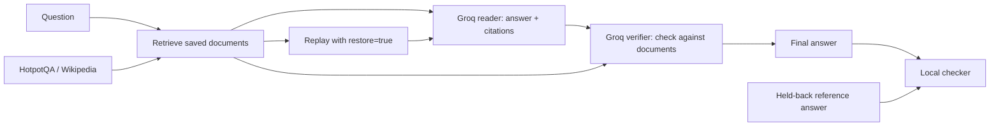

# Research workflow

Research uses actual HotpotQA / Wikipedia passages and actual calls to the configured Groq model. Travel remains a separate synthetic benchmark.

## Setup

Set `MODE=live`, `GROQ_API_KEY`, and `AGENT_MODEL` in the server's `.env`. The default model is `openai/gpt-oss-20b`. GPT-OSS models use strict JSON schemas; other compatible models must support JSON-object responses.

```sh
uv run --locked python -m agents.research download --split train --count 24
uv run --locked python -m agents.research download --split validation --count 24
make dev-api
make dev-web
```

Open `http://localhost:3000/new`, choose Research, and select a question. Custom prompts search the downloaded corpus by lexical overlap; they do not search the web. Unrelated questions return a clear error. Unsupported or missing provider configuration never falls back to fixture answers.

## Execution



The six recorded steps are task state, retrieval, reader, verifier, final state, and checker. Each model request, response, token usage, checkpoint and dependency is recorded. The checker is excluded from diagnosis features. It verifies quotation text and sentence indices; known benchmark questions additionally require normalized exact answer match and citations to all annotated supporting documents. Exact matching can reject equivalent aliases, and valid citations alone do not prove semantic correctness for custom questions.

Empty retrieval is an explicit controlled fault. Restoring the saved source passages changes the tool argument, then the downstream model calls execute again. Provider randomness can still produce an incorrect answer; verification reports the measured result, rather than guaranteeing success. The reference answer is never supplied to the reader, verifier, or proposed repair.

## Live pilot training

These commands consume provider quota:

```sh
uv run --locked --extra ml python -m agents.research collect --count 4
uv run --locked --extra ml python -m agents.research train
```

`collect --count 4` records four train and four validation questions, each with healthy and empty-retrieval variants: up to 16 runs and 32 model calls before retries. Completed injected failures get retrieval root labels. Natural failures remain unlabelled. The ranker needs at least four labelled train failures, two validation failures and a healthy train reference.

The research model is stored separately at `data/models/research-pilot-v1/` and is loaded after API restart. Train and validation question IDs must not overlap. Validation is used for early stopping and calibration, so it is **not an independent test score**. One controlled fault family cannot demonstrate generalization to unseen failures; collect varied faults and independently labelled natural failures before claiming that.

## Files and attribution

- `data/research/hotpotqa-{train,validation}.json`: downloaded rows, source, timestamp and SHA-256 checksum.
- `data/research/research-tasks/*.json`: immutable task document snapshots and checker-only references.
- `data/research/blackbox.db` and `content/`: actual execution traces and content-addressed payloads.
- `data/research/live-report.json`: measured run outcomes.
- `data/models/research-pilot-v1/`: fitted LightGBM model, reference features and training metadata.

All are ignored by Git; credentials stay in `.env`. Exported regression tests freeze the required document snapshot and model responses and execute offline. They check reproducibility of a previously verified fix, not the current model's performance.

Source: [HotpotQA dataset](https://huggingface.co/datasets/hotpotqa/hotpot_qa), [HotpotQA project and paper](https://hotpotqa.github.io/). Dataset license: [CC BY-SA 4.0](https://creativecommons.org/licenses/by-sa/4.0/). Wikipedia links identify the original articles; the actual passages are historical benchmark snapshots and may differ from current articles.
